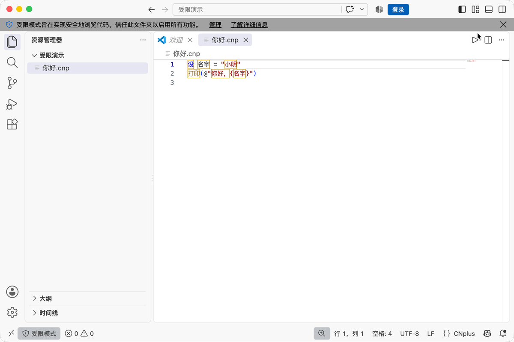
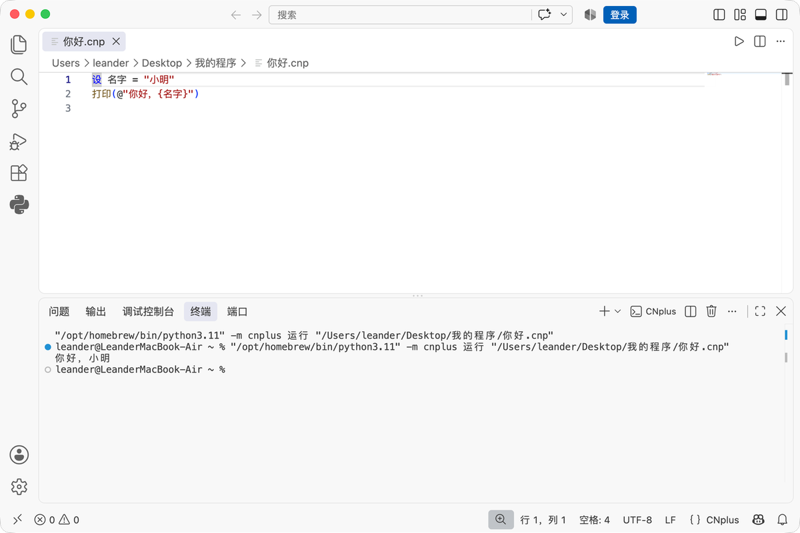

# 开始

> 欢迎来到 CNplus！这一篇是序言——先认识它、挑一条路开始写代码，然后进入第一课。

## 你好，CNplus

CNplus 是一门**中文编程语言**：关键字、类型、报错全是中文。写程序不用先「翻译」一遍英文，直接顺着中文说：

```cnp
设 名字 = "小明"
打印(@"你好，{名字}")
```

跑起来，屏幕输出 `你好，小明`。

## 它是怎么来的

CNplus 始于 **2021 年 12 月**，最初只是一层中文函数名封装；**2022 年 6 月**想用 C++ 重做成 IDLE，停在一个没写完的 `cout` 上。**2026 年重启**，这次不急着堆功能，先搭好「源码 → 抽象语法树」和「语法树 → 执行」之间的接缝，再往上盖楼。所以它有自己的词法器、语法分析器和抽象语法树，执行后端可插拔。

## 它哪里不一样

- 🌏 **全中文**：关键字、类型名、报错、诊断码全是中文
- 💬 **三层报错**：术语 + 大白话 + 能直接照抄的改法
- 🗣️ **一意多写**：`设`＝`令`＝`让`，用你顺口的那个
- 🧱 **严格语义**：新手最常踩的坑被当场堵死（`如果 0` 直接报错，不让你懵）

后面每一章会逐个展开。

## 三种写代码的途径

代码都一样，只是「在哪里写、怎么跑」不同。按你的情况挑一条：

| 途径 | 适合谁 | 一句话 |
|---|---|---|
| 🖥️ [用 VSCode 写](#用-vscode-写) | 想认真学、长期写 | **最推荐**——语法高亮、实时诊断、补全、悬停、跳转定义、一键运行 |
| 🌐 [在网页上写](#在网页上写) | 只想先试试、不想装任何东西 | **最简单**——打开就能写，但扩展性不足 |
| ⌨️ [用命令行跑](#用命令行跑) | 已装好环境、想快速跑 | 脚本化、批处理的补充 |

点上面任意一条，直接跳到对应说明。

---

## 用 VSCode 写

日常写代码就选它，装一次、一直用。全程约 10 分钟，不需要任何编程基础。

### 第 0 步：确认 Python 版本

CNplus 跑在 Python 上，需要 **Python 3.11 或更新**。

先打开「终端」：按 `⌘空格`，输入「终端」回车（或访达 → 应用程序 → 实用工具 → 终端）。打开后输入：

```bash
python3 --version
```

两种结果，对号入座：

- 显示 `Python 3.11`、`3.12`、`3.13` → 直接往下走，后面命令里的 `python3` 原样用。
- 显示 `Python 3.9` 或更老（macOS 自带的旧 Python）→ 需要先装个新的，见下面小字。

> **装新 Python 的办法（任选其一）：**
> - 官网安装包：去 [python.org](https://www.python.org/downloads/) 下载 3.11 或更新的安装包，一路「继续」装完。
> - Homebrew（程序员常用）：`brew install python@3.11`，装完后命令叫 `python3.11`。
>
> 下面这套演示就发生在「系统自带 3.9」的电脑上，所以命令里写的是 `python3.11`。**如果你的 `python3 --version` 已经是 3.11+，把命令里的 `python3.11` 换成 `python3` 即可，其余不变。**

### 第 1 步：下载并安装 CNplus

回到终端，**一行一行**输入（每行输完按回车，等它跑完再输下一行）：

```bash
cd ~/Desktop
git clone https://github.com/CNplus/CNplus-lang.git
cd CNplus-lang
python3.11 -m pip install -e ".[lsp]"
```

- 第二行把 CNplus 下载到桌面的 `CNplus-lang` 文件夹，跑完会显示 `Receiving objects` 之类的进度。
- 第四行是安装，最后一行出现 **`Successfully installed cnplus-<版本>`** 就装好了。

> 这一步把 CNplus 装进了 Python 3.11，VSCode 扩展会自动找到它。装完还会多出一个 `cnp` 命令，下一节就用它。

### 第 2 步：先跑通一个示例

```bash
cnp 运行 示例/01-你好.cnp
```

屏幕输出 `你好，世界！`，说明本体装好了。

### 第 3 步：装 VSCode 扩展

**1. 下载**：从 [GitHub Release](https://github.com/CNplus/CNplus-lang/releases) 下载最新的 `cnplus-<版本>.vsix` 文件。

**2. 安装**：在 VSCode 里按 `⌘⇧X`（Windows/Linux 是 `Ctrl+Shift+X`）打开扩展面板，点右上角 `…` → 「从 VSIX 安装…」，选中下载的 `.vsix` 文件。

**3. 重启**：完全退出 VSCode 再打开（`⌘Q`，不是关窗口），扩展才会加载。

装好后，扩展面板的「已安装」列表里会出现一个 **CNplus**（中文编程语言支持：语法高亮、实时中文诊断、补全、悬停、跳转定义、F5 运行），就说明装对了。

### 第 4 步：信任工作区（重要，别跳过）

**VSCode 出于安全，默认「不信任」桌面、下载文件夹等位置的代码，此时 CNplus 扩展会被禁用——高亮、F5 运行、实时报错全都不工作，看起来就像「没装好」。**

打开 `.cnp` 文件后，看窗口**左下角**：



- 如果显示 **「受限模式」**（或者弹出「CNplus：当前窗口不受信任」的提示）→ 点击它 → 选 **「信任」**，扩展立刻生效。
- 更省事的做法：把代码放进一个文件夹，用「文件 → 打开文件夹」打开**整个目录**，在弹出的信任提示里选「信任」。

> 扩展现在的版本会在不受信任时主动弹提示、附「信任此工作区」按钮，照做即可。信任后若提示「重新加载窗口」，点一下。

### 第 5 步：写第一个程序

**1.** 打开 VSCode，菜单「文件 → 打开文件夹」，选一个你自己的文件夹（比如在桌面新建一个「我的程序」）。

**2.** 在左侧文件列表空白处右键 → 「新建文件」，命名为 `你好.cnp`（扩展名必须是 `.cnp`，不是 `.txt`）。

**3.** 粘贴这两行代码：

```cnp
设 名字 = "小明"
打印(@"你好，{名字}")
```

代码会自动上色（语法高亮），右上角出现一个 ▶ 运行按钮：



**4.** 按 **F5**（或点编辑器右上角的 ▶ 按钮）。下方「终端」会输出：

```text
你好，小明
```

看到这行字，你就已经会用 CNplus 写程序了。刚才那两行是「变量」和「格式串」，具体含义[第一课](01-起步/01-变量与类型/01-教程.md)会讲。

> **按 F5 没反应？** 先回到第 4 步：看左下角，如果是「受限模式」，点信任后再按一次 F5。
> **笔记本的 F5 键**：Mac 笔记本上 F5 默认是调节亮度，可能需要同时按住 `fn` 键（`fn`+`F5`），或者干脆点 ▶ 按钮。

### 排查：扩展怎么找到 Python

F5 运行时，扩展要找到装了 CNplus 的 Python。它会按顺序自动找：**工作区的 `.venv` → Homebrew → 系统 Python**，找到第一个能用的就停下，你不用手填路径。

想知道它到底用了哪个 Python？在 VSCode 里按 `⌘⇧P`，输入「显示当前使用的解释器」，回车就能看到。

> 如果 F5 报「找不到解释器」或运行结果不对，先跑这个命令看看——八成是它选了一个没装 CNplus 的 Python。回到[第 1 步](#第-1-步下载并安装-cnplus)，把 CNplus 装进它选的那个 Python 就行。

---

## 在网页上写

最简单，零安装。打开 [cnplus.org/playground](https://cnplus.org/playground)，浏览器里直接写代码、直接跑，**什么都不用装**，还支持把代码生成分享链接（URL 里带代码）。

**适合**：想先试试 CNplus、又不想折腾环境的。

**局限（扩展性不足）**：不能装插件、不能读写本地文件、代码用完就没了、没法存成自己的项目。所以认真学下去，早晚还是得回到[用 VSCode 写](#用-vscode-写)。

---

## 用命令行跑

适合已装好环境、想快速跑一段，或做脚本化、批处理。

先按上面[第 1 步](#第-1-步下载并安装-cnplus)装好 CNplus 本体（**不用装 VSCode 扩展**），然后在终端里：

```bash
cnp 运行 我的程序.cnp
```

### 三个执行后端：结果一样，按需挑

同一份代码，有三种执行方式，**结果完全一样**（三后端逐字对拍）。知道 `cnp 运行` 就够日常用，其余按需查：

| 执行后端 | 命令 | 什么时候用 |
|---|---|---|
| 树遍历 | `cnp 运行 x.cnp` | 日常，最直接 |
| Python 转译 | `cnp 运行 --python x.cnp` | 程序要 `导入` Python 库时 |
| JS 转译 | `cnp 编译 x.cnp --js` | 想生成 `.js` 在网页 / node 里跑 |

> 💡 **别混淆**：「用 VSCode 写 / 在网页上写 / 用命令行跑」是**三种用法**（在哪里写、怎么跑）；「树遍历 / Python 转译 / JS 转译」是**三个执行后端**（代码底层怎么执行）。用法和后端是两码事，别被同一个「后端」字眼绕晕。

还有两个常用命令：

- `cnp 交互`：不建文件，输入一行立即出结果，随手试代码
- `cnp 检查 x.cnp`：只查错，不执行

### 命令行速查

| 命令 | 作用 |
|---|---|
| `cnp 运行 x.cnp` | 直接解释执行 |
| `cnp 运行 --python x.cnp` | 转译成 Python 再执行（能借用 pip 库） |
| `cnp 编译 x.cnp` | 生成独立的 `.py` 文件，可到处运行 |
| `cnp 编译 x.cnp --js` | 生成独立的 `.js`，node 或浏览器能跑 |
| `cnp 交互` | 交互式对话，输入一行立即出结果（不用建文件） |
| `cnp 检查 x.cnp` | 只查错，不执行 |
| `cnp 词法 x.cnp` | 打印词元流（调试用） |
| `cnp 语法树 x.cnp` | 打印语法树（调试用） |
| `cnp 版本` | 显示版本 |

---

准备好了就开始第一课：

**接下来：[变量与类型](01-起步/01-变量与类型/01-教程.md)**
